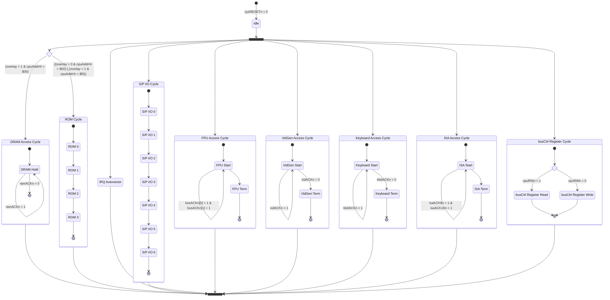

# Wrap030-ATX Bus Controller

## Bus Controller Feature Description

The bus controller handles decoding the CPU Function Codes and Address bus to activate system memory and peripherals. For devices which do not produce their own bus cycle acknowledge signals, it handles timing & wait state generation and produces the appropriate cycle termination signals. It also receives incoming cycle termination signals from other bus devices and reproduces them for the CPU, meeting setup timing requirements. The bus controller generates a bus error for invalid accesses, missing FPU, and bus cycles which time out with no other external device providing an appropriate termination. It will also assert the CPU's cache inhibit signal for peripheral accesses which should not be cached. 

On initial power on, the bus controller will pull the power supply's power on signal low and hold it until the soft power bit in the bus controller register is cleared. 

The bus controller has an internal register accessible at address `$e000,0000` which holds the startup overlay enable bit, soft power control bit, and a general-purpose output for driving an LED.

## Bus Controller Cycles

- DRAM
  - Asserts the RAM chip enable signal and waits for the memory controller to assert its cycle ackowledge signal. 
- ROM
  - Asserts the ROM chip enable signal and the appropriate memory read or write strobe. Inserts wait states for a 70ns ROM and terminates bus cycle.
- Video Controller
  - Asserts the video chip enable signal and waits for the video generator to assert its cycle acknowledge signal.
- ISA
  - Asserts the ISA chip enable signal and waits for the ISA bus controlelr to assert the appropriate 8-bit or 16-bit cycle acknowledge signal.
- Serial/Parallel I/O
  - Asserts the SPIO chip enable signal and the appropriate memory read or write strobe. Inserts wait states for WD16C552 and terminates bus cycle.
- Keyboard Controller
  - Asserts the keyboard controller chip enable signal and waits for the keyboard controller to assert its cycle acknowledge signal.
- DRAM Controller
  - If startup overlay bit is clear:
    - Asserts the DRAM controller chip enable signal and waits for the DRAM controller to assert its cycle acknowledge signal.
  - If startup overlay bit is set:
    - Generates a bus error.
- Bus Controller
  - Reads or writes the bus controller register as appropriate and terminates the bus cycle.
- Interrupt Controller
  - Asserts the interrupt controller chip enable signal and waits for the interrupt controller to assert its cycle acknowledge signal.

## Bus Controller Settings Register
0. Startup Overlay
   - **SET**: Disable startup overlay
   - **CLEAR**: Enable startup overlay
1. Soft Power
   - **SET**: Power down
   - **CLEAR**: Normal operation
2. GPO LED
   - **SET**: LED on
   - **CLEAR**: LED off
3. (future use)
4. (future use)
5. (future use)
6. (future use)
7. (future use)

## Bus Controller State Machine

